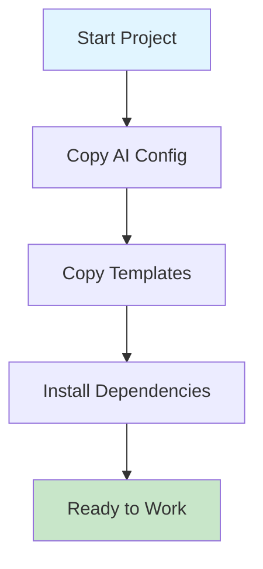
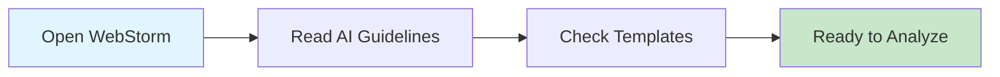
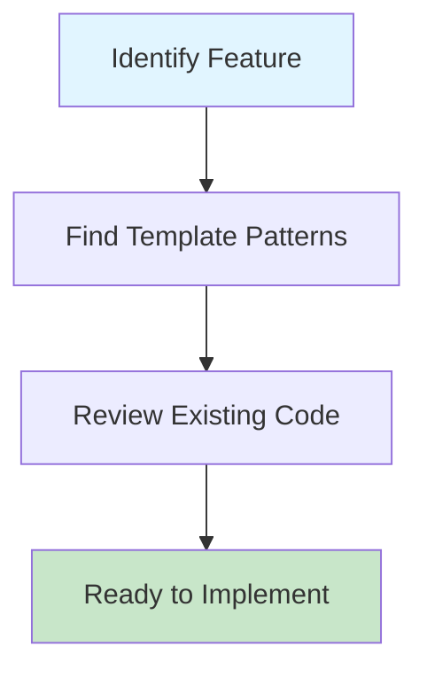
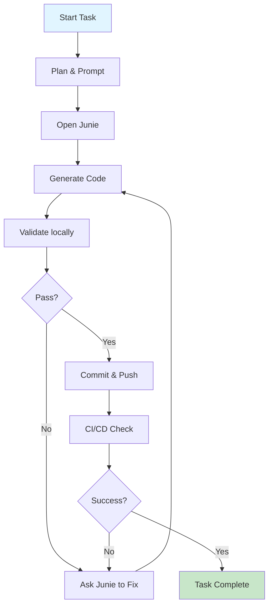
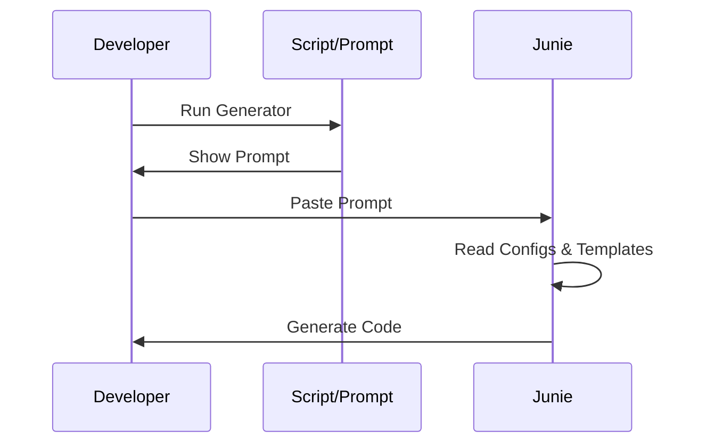
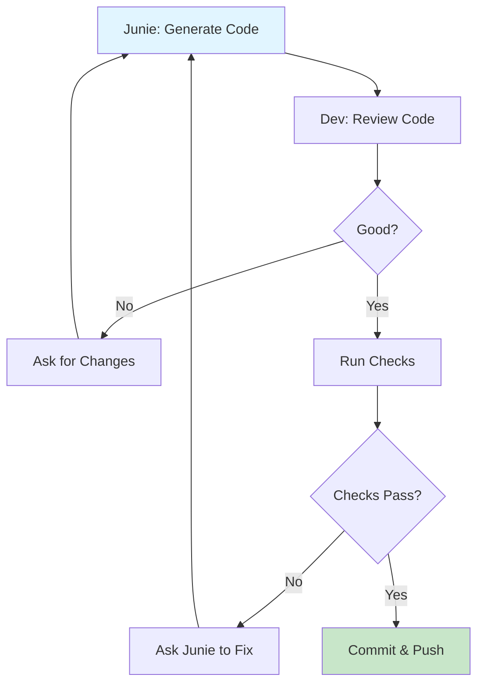
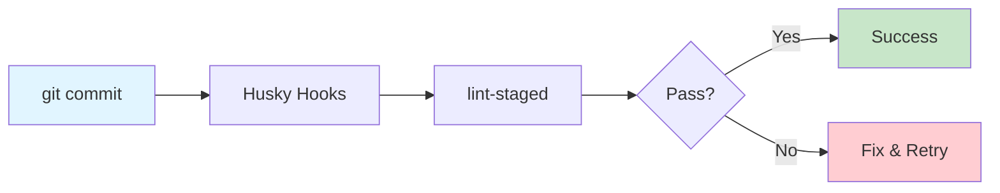
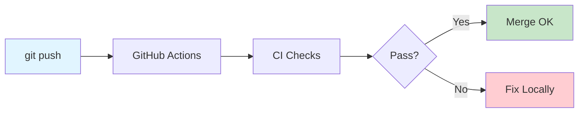

# 🚀 Complete Workflow Guide: Working with Junie + WebStorm

> **A comprehensive guide to maximize productivity using AI-assisted development with Junie, WebStorm, and this template system**

---

## 📊 Time Savings Estimate

### Without This System
- **Manual code generation**: 2-4 hours per feature
- **Pattern inconsistency**: 1-2 hours debugging/refactoring
- **Documentation lookup**: 30-60 minutes per task
- **Code review cycles**: 2-3 iterations
- **Total per feature**: ~6-10 hours

### With This System
- **AI-assisted generation**: 30-60 minutes per feature
- **Pattern consistency**: Built-in (0 extra time)
- **Documentation**: Instant access (0 extra time)
- **Code review cycles**: 1 iteration (automated validation)
- **Total per feature**: ~1-2 hours

### **Estimated Time Savings: 70-80% reduction in development time**

---

## 🎯 Step-by-Step: Creating Prompts for Junie

### Method 1: Using the Prompt Generator (Fastest)

#### Step 1: Run the Generator

```bash
# Interactive mode (recommended for beginners)
./scripts/generate-prompt.sh

# Direct mode (for experienced users)
./scripts/generate-prompt.sh feature wallet-connection web3,typescript,ui-shadcn
```

#### Step 2: Follow Interactive Prompts

```
=== Interactive Mode ===

Select prompt type:
1) Feature (new feature)
2) Component (UI component)
3) Hook (custom React hook)
4) Contract (smart contract)
5) Test (test suite)
6) Refactor (code refactoring)
7) Review (code review)
8) Fix (bug fix)
Option (1-8): 1

Name (e.g., wallet-connection, Button, useTokenBalance): wallet-connection

Select templates (you can select multiple):
1) nextjs
2) typescript
3) web3
4) database
5) ui-shadcn
6) ui-tailwind
7) audit

Enter template numbers separated by commas (e.g., 1,2 or 1,3,5): 3,2,5
```

#### Step 3: Copy Generated Prompt

The script outputs a complete prompt:

```markdown
## Context
- Project: web3,typescript,ui-shadcn
- Follow: .junie/guidelines.md strictly
- Templates:
- templates/web3/
- templates/typescript/
- templates/ui-shadcn/

## Task
Implement wallet-connection.

## Files to Create/Modify
- [ ] [file path 1]
- [ ] [file path 2]

## Constraints
- TypeScript strict mode
- Use existing patterns from the templates above
- No new dependencies without approval
- pnpm only
- Follow Prettier configuration (.prettierrc)

## Acceptance Criteria
- [ ] All types explicit
- [ ] Zod validation for inputs (if applicable)
- [ ] Error handling complete
- [ ] Tests included
- [ ] Code formatted with Prettier
- [ ] No ESLint errors
```

#### Step 4: Customize (Optional)

Before sending to Junie, add specific details:

```markdown
## Files to Create/Modify
- [ ] lib/wagmi.ts
- [ ] components/ConnectButton.tsx
- [ ] app/layout.tsx (add provider)

## Additional Context
Use AppKit (Web3Modal) for wallet connection.
Support Mainnet and Sepolia networks.
Include disconnect functionality.
```

#### Step 5: Send to Junie in WebStorm

1. Open Junie panel in WebStorm (usually right sidebar)
2. Paste the complete prompt
3. Press Enter or click Send
4. Wait for Junie to generate code

### Method 2: Manual Prompt Creation

#### Step 1: Open Prompt Library

```bash
# Open in your editor
code .junie/prompts.md
# or
open .junie/prompts.md
```

#### Step 2: Select Template

Choose from available templates:
- New Feature Implementation
- Isolated Function
- Security Review
- Web3 Security Review
- Component Creation
- Refactoring
- Bug Fix

#### Step 3: Copy and Customize

```markdown
## Context
- Project: [Your project type]
- Follow: .junie/guidelines.md strictly
- Template: templates/[relevant-template]/

## Task
[Describe what you want to implement]

## Files to Create/Modify
- [ ] [specific file paths]

## Constraints
- [Your specific constraints]

## Acceptance Criteria
- [ ] [Your specific criteria]
```

---

## 🔍 Project Analysis Workflow

### Phase 1: Initial Setup (One-Time, ~10 minutes)



**Commands:**
```bash
# 1. Copy AI configuration
cp -r /path/to/this/repo/.junie /path/to/your/project/

# 2. Copy formatting standards
cp /path/to/this/repo/.prettierrc /path/to/your/project/

# 3. Copy templates you need
cp -r /path/to/this/repo/templates/nextjs /path/to/your/project/
cp -r /path/to/this/repo/templates/web3 /path/to/your/project/

# 4. Install dependencies
cd /path/to/your/project/
pnpm install

# 5. Optional: Setup pre-commit hooks (see automation.md)
pnpm add -D husky lint-staged
pnpm exec husky init
```

### Phase 2: Understanding Project Structure (~5 minutes)



**Key Files to Review:**
1. `.junie/README.md` - System overview
2. `.junie/guidelines.md` - Behavioral rules
3. `.junie/skills.md` - Technical capabilities
4. `.junie/workflow.md` - Task boundaries
5. `.junie/docs/automation.md` - Quality gates
6. `templates/[domain]/guidelines.md` - Domain-specific patterns

### Phase 3: Analyzing Existing Code (~10-15 minutes)



**Analysis Checklist:**
- [ ] What domain does this belong to? (nextjs, web3, database, etc.)
- [ ] Are there similar patterns in `templates/[domain]/`?
- [ ] What dependencies are used?
- [ ] Is there existing test coverage?
- [ ] What's the current code quality? (run `pnpm lint`)
- [ ] Are there TypeScript errors? (run `pnpm typecheck`)

---

## 🔄 Complete Development Workflow with Junie + WebStorm



---

## 🎨 Detailed Workflow: Prompt Generation Flow



---

## ⚙️ Code Generation and Validation Cycle



---

## 🖥️ WebStorm + Junie Integration

### Opening Junie in WebStorm

1. **Method 1: Sidebar**
   - Look for "Junie" or "AI Assistant" icon in right sidebar
   - Click to open panel

2. **Method 2: Menu**
   - Go to `Tools` → `AI Assistant` → `Open Junie`

3. **Method 3: Keyboard Shortcut**
   - Default: `Cmd+Shift+A` (macOS) or `Ctrl+Shift+A` (Windows/Linux)
   - Type "Junie" and select "Open AI Assistant"

### Using Junie in WebStorm

```
┌─────────────────────────────────────────────────────────────┐
│ WebStorm IDE                                                │
├─────────────────────────────────────────────────────────────┤
│                                                             │
│  ┌─────────────────┐  ┌─────────────────────────────────┐  │
│  │                 │  │                                 │  │
│  │  File Explorer  │  │  Code Editor                    │  │
│  │                 │  │                                 │  │
│  │  src/           │  │  // Generated by Junie          │  │
│  │  ├── features/  │  │  export function useWallet() {  │  │
│  │  ├── lib/       │  │    // ...                       │  │
│  │  └── app/       │  │  }                              │  │
│  │                 │  │                                 │  │
│  └─────────────────┘  └─────────────────────────────────┘  │
│                                                             │
│  ┌─────────────────────────────────────────────────────┐   │
│  │ Terminal                                            │   │
│  │ $ pnpm lint                                         │   │
│  │ ✓ No lint errors                                    │   │
│  │ $ pnpm typecheck                                    │   │
│  │ ✓ No type errors                                    │   │
│  └─────────────────────────────────────────────────────┘   │
│                                                             │
│  ┌─────────────────────────────────────────────────────┐   │
│  │ Junie AI Assistant                          [Right] │   │
│  ├─────────────────────────────────────────────────────┤   │
│  │ You: Implement wallet connection using AppKit       │   │
│  │                                                     │   │
│  │ Junie: I'll implement wallet connection following  │   │
│  │ templates/web3/guidelines.md. Creating:             │   │
│  │ - lib/wagmi.ts                                      │   │
│  │ - components/ConnectButton.tsx                      │   │
│  │                                                     │   │
│  │ [Code generated in editor]                          │   │
│  │                                                     │   │
│  │ [Type your prompt here...]                          │   │
│  └─────────────────────────────────────────────────────┘   │
└─────────────────────────────────────────────────────────────┘
```

### Terminal Commands in WebStorm

Open terminal: `Alt+F12` (Windows/Linux) or `Option+F12` (macOS)

```bash
# Validation commands
pnpm lint           # Check code quality
pnpm format         # Format code with Prettier
pnpm typecheck      # Check TypeScript types
pnpm test           # Run tests

# Development
pnpm dev            # Start dev server
pnpm build          # Build for production

# Git
git status          # Check changes
git add .           # Stage all changes
git commit          # Commit (triggers pre-commit hooks)
git push            # Push to remote
```

---

## 🎯 Practical Example: Complete Feature Implementation

### Scenario: Implement Wallet Connection for Web3 dApp

#### Step 1: Generate Prompt (30 seconds)

```bash
./scripts/generate-prompt.sh feature wallet-connection web3
```

#### Step 2: Customize Prompt (1 minute)

```markdown
## Context
- Project: web3
- Follow: .junie/guidelines.md strictly
- Template: templates/web3/

## Task
Implement wallet-connection with AppKit (Web3Modal).

## Files to Create/Modify
- [ ] lib/wagmi.ts (Wagmi configuration)
- [ ] components/ConnectButton.tsx (Connect wallet button)
- [ ] app/layout.tsx (Add WagmiProvider)
- [ ] app/providers.tsx (Client-side providers)

## Constraints
- TypeScript strict mode
- Use AppKit (Web3Modal)
- Support Mainnet and Sepolia
- Use patterns from templates/web3/
- pnpm only
- Follow Prettier configuration (.prettierrc)

## Acceptance Criteria
- [ ] Wallet connects successfully
- [ ] Supports multiple wallets (MetaMask, WalletConnect, etc.)
- [ ] Shows connected address
- [ ] Disconnect functionality works
- [ ] All types explicit
- [ ] Error handling complete
- [ ] Tests included
- [ ] Code formatted with Prettier
- [ ] No ESLint errors

## Additional Context
Use @reown/appkit and @reown/appkit-adapter-wagmi packages.
Get WalletConnect Project ID from environment variable.
```

#### Step 3: Send to Junie (5 seconds)

1. Open Junie in WebStorm
2. Paste prompt
3. Press Enter

#### Step 4: Junie Generates Code (2-3 minutes)

Junie creates:
- `lib/wagmi.ts` - Wagmi configuration with AppKit
- `components/ConnectButton.tsx` - Connect wallet button component
- `app/providers.tsx` - Client-side providers wrapper
- `app/layout.tsx` - Updated with providers

#### Step 5: Review Code (2-3 minutes)

Check generated files in WebStorm:
- Verify imports are correct
- Check TypeScript types
- Review component structure
- Ensure patterns match templates/web3/

#### Step 6: Run Validation (2 minutes)

```bash
pnpm lint        # ✓ No errors
pnpm format      # ✓ Formatted
pnpm typecheck   # ✓ No type errors
pnpm test        # ✓ All tests pass
```

#### Step 7: Test Manually (5 minutes)

```bash
pnpm dev
```

Open browser:
- Click "Connect Wallet"
- Connect with MetaMask
- Verify address displays
- Test disconnect
- Test network switching

#### Step 8: Commit (1 minute)

```bash
git add .
git commit -m "feat(web3): add wallet connection with AppKit"
# Pre-commit hooks run automatically
git push
```

#### Step 9: CI/CD Validation (3-5 minutes)

GitHub Actions runs:
- Lint check ✓
- Type check ✓
- Tests ✓
- Build ✓

**Total Time: ~15-20 minutes** (vs 2-4 hours manually)

---

## 🚦 Quality Gates

### Local Validation (Pre-commit)



### Remote Validation (CI/CD)



---

## 📚 Quick Reference

### Essential Commands

```bash
# Prompt generation
./scripts/generate-prompt.sh                    # Interactive mode
./scripts/generate-prompt.sh feature NAME web3  # Direct mode

# Validation
pnpm lint                                       # Check code quality
pnpm format                                     # Format code
pnpm typecheck                                  # Check types
pnpm test                                       # Run tests
pnpm validate                                   # Run all checks

# Development
pnpm dev                                        # Start dev server
pnpm build                                      # Build for production

# Git
git add .                                       # Stage changes
git commit -m "feat: description"               # Commit (conventional)
git push                                        # Push to remote
```

### Key Files

| File | Purpose | When to Read |
|------|---------|--------------|
| `.junie/README.md` | System overview | First time setup |
| `.junie/guidelines.md` | Behavioral rules | Every task |
| `.junie/skills.md` | Technical knowledge | Technical decisions |
| `.junie/workflow.md` | Task boundaries | Before starting tasks |
| `.junie/prompts.md` | Prompt templates | Creating prompts |
| `.junie/docs/automation.md` | CI/CD setup | Setting up automation |
| `templates/[domain]/guidelines.md` | Domain patterns | Domain-specific work |

### Junie Workflow Checklist

- [ ] Read `.junie/workflow.md` - Understand boundaries
- [ ] Search `templates/` - Find existing patterns
- [ ] Generate prompt - Use script or manual
- [ ] Customize prompt - Add specific requirements
- [ ] Send to Junie - Paste in WebStorm
- [ ] Review code - Check generated files
- [ ] Run validation - lint, format, typecheck, test
- [ ] Test manually - Verify functionality
- [ ] Commit - Use Conventional Commits
- [ ] Push - Let CI/CD validate

---

## 🎓 Best Practices

### 1. Always Start with Templates

```bash
# Before asking Junie to create something new
ls templates/
cat templates/web3/guidelines.md
```

### 2. Use Descriptive Prompts

❌ **Bad**: "Create a button"

✅ **Good**: 
```markdown
## Context
- Project: ui-shadcn
- Follow: .junie/guidelines.md
- Template: templates/ui/shadcn/

## Task
Create an accessible Button component with variants (primary, secondary, destructive).

## Requirements
- [ ] TypeScript with explicit types
- [ ] Accessible (ARIA attributes)
- [ ] Responsive design
- [ ] Dark mode support
- [ ] Compound component pattern for ButtonGroup
```

### 3. Validate Early and Often

```bash
# After every code generation
pnpm lint && pnpm format && pnpm typecheck && pnpm test
```

### 4. Commit Frequently

```bash
# Small, atomic commits
git commit -m "feat(ui): add Button component"
git commit -m "feat(ui): add ButtonGroup component"
git commit -m "test(ui): add Button tests"
```

### 5. Let Junie Fix Issues

Instead of manually fixing lint/type errors:

```
Junie, fix the ESLint errors in src/components/Button.tsx
```

---

## 🔧 Troubleshooting

### Junie Not Following Guidelines

**Problem**: Junie generates code that doesn't follow patterns

**Solution**:
```markdown
## Context
- Follow: .junie/guidelines.md STRICTLY
- Template: templates/web3/ (READ THIS FIRST)

## Task
[Your task]

## Important
Before generating code, read:
1. .junie/guidelines.md
2. templates/web3/guidelines.md
3. templates/web3/CLAUDE.md
```

### Validation Failures

**Problem**: `pnpm lint` or `pnpm typecheck` fails

**Solution**:
```bash
# Show errors to Junie
pnpm lint 2>&1 | pbcopy  # macOS
pnpm lint 2>&1 | clip    # Windows

# Then tell Junie:
"Fix these lint errors: [paste errors]"
```

### Pre-commit Hooks Failing

**Problem**: Commit blocked by hooks

**Solution**:
```bash
# See what failed
git commit -v

# Fix issues
pnpm lint:fix
pnpm format

# Try again
git commit
```

### CI/CD Pipeline Failing

**Problem**: GitHub Actions fails

**Solution**:
1. Check logs in GitHub Actions tab
2. Run same commands locally:
   ```bash
   pnpm install
   pnpm lint
   pnpm typecheck
   pnpm test
   pnpm build
   ```
3. Fix issues locally
4. Commit and push again

---

## 📈 Measuring Success

### Metrics to Track

1. **Time per Feature**
   - Before: 6-10 hours
   - Target: 1-2 hours
   - Measure: Track time from task start to PR merge

2. **Code Review Cycles**
   - Before: 2-3 iterations
   - Target: 1 iteration
   - Measure: Count PR review rounds

3. **Bug Rate**
   - Before: Variable
   - Target: Reduced by 50%
   - Measure: Track bugs per feature

4. **Test Coverage**
   - Before: Variable
   - Target: >80%
   - Measure: Run `pnpm test:coverage`

5. **Code Consistency**
   - Before: Variable
   - Target: 100% (automated)
   - Measure: Lint/format pass rate

---


## 📞 Support

### Resources

- **Documentation**: See all `.junie/*.md` files and `.junie/docs/*.md`
- **Templates**: See `../../templates/README.md`
- **Automation**: See `automation.md`
- **Prompts**: See `../prompts.md`
- **Scripts**: See `../../scripts/README.md`
- **Project Overview**: See `../../README.md`

### Common Questions

**Q: Can I use this with other AI assistants?**
A: Yes! The system works with Claude, Cursor AI, Aider, and other AI coding assistants. Just reference the `.junie/` files in your prompts.

**Q: Do I need all templates?**
A: No. Copy only the templates you need for your project (e.g., just `nextjs/` and `web3/` for a Web3 dApp).

**Q: Can I customize the templates?**
A: Yes! Templates are starting points. Customize them for your project's specific needs.

**Q: What if Junie makes mistakes?**
A: The validation layer (lint, typecheck, tests, CI/CD) catches issues automatically. Ask Junie to fix them.

---

## 🎉 Success Stories

### Example 1: Web3 dApp Development

**Before**: 
- 8 hours to implement wallet connection
- 3 code review cycles
- 2 bugs found in production

**After**:
- 20 minutes to implement wallet connection
- 1 code review cycle
- 0 bugs (caught by automated tests)

**Time Saved**: 7.5 hours (94%)

### Example 2: Next.js Feature Development

**Before**:
- 6 hours to implement user authentication
- Inconsistent patterns across team
- Manual code reviews for style

**After**:
- 1.5 hours to implement user authentication
- Consistent patterns (enforced by templates)
- Automated style checks

**Time Saved**: 4.5 hours (75%)

---

## 📝 Conclusion

This workflow system transforms AI-assisted development from ad-hoc code generation to a structured, quality-enforced process. By combining:

1. **Clear guidelines** (`.junie/`)
2. **Proven patterns** (`templates/`)
3. **Automated validation** (`AUTOMATION.md`)
4. **AI assistance** (Junie)
5. **IDE integration** (WebStorm)

You achieve:
- ✅ **70-80% faster development**
- ✅ **Consistent code quality**
- ✅ **Fewer bugs**
- ✅ **Better maintainability**
- ✅ **Happier developers**

**Start today and experience the difference!**

---

*For more information, see the main [README.md](../../README.md) and [automation.md](automation.md).*
